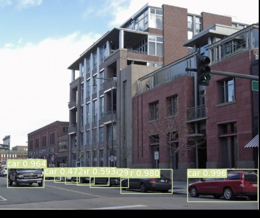
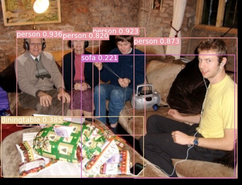

## RetinaNet: Focal Loss for Dense Object Detection

###  AP Result
| PASCAL VOC (800px) | COCO(800px) |
| :-----------: | :-----------------: |
|     **81.6 (IoU.5)**      |      **36.4**       |

### Requirements  
* opencv-python  
* pytorch >= 1.0  
* torchvision >= 0.4. 
* matplotlib
* cython
* numpy == 1.17
* Pillow
* tqdm
* pycocotools

### Results in coco 
Train coco2017 on 4 Tesla-V100, 4 imgs for each gpu, init lr=1e-2  using GN GIou.


You can download the 36.4 ap result in [Baidu driver link](https://pan.baidu.com/s/1bOgnCNRitOXN4aH6aaNoSw), password: 421x,then put it in checkpoint folder, then run the coco_eval.py

### Results in Pascal Voc
Train Voc07+12 on 4 Tesla-V100 , 4 imgs for each gpu, init lr=1e-2  using GN,GIou.  

You can download the 81.6 ap result in [Baidu driver link](https://pan.baidu.com/s/1raHeFISLmmHbNd_gghAMQA), password:emkw, then put it in checkpoint folder, then run the eval_voc.py and

```
### Detect Image   
You can run the detect.py to detect images , this repo provides PASCAL VOC Images detection demo.
  
  